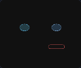

# VisemeSync

**Deskbot 口型 / 表情可视化设计工具** — 专为 OLED 屏幕而生，所见即所得，导出即可上机。

VisemeSync 是一套纯静态前端编辑器（无需 Node.js），用与设备端一致的 **OLED 绘图原语** 在浏览器里设计人脸。你画出的每一个图元，最终都会变成设备上的 `drawRoundRect`、`fillEllipse` 等函数调用 —— **渲染快、体积小、零位图依赖**。

---

## 为什么选择 VisemeSync？

| 特点 | 说明 |
|------|------|
| **OLED 原生绘制** | 图元类型与 Deskbot pb / OLED 协议完全一致（`round_rect_outline`、`ellipse_fill`、`line` 等），矢量指令直接下发，不存 PNG/SVG |
| **速度快、体积小** | 无图片资源，JSON 仅描述坐标与参数；嵌入式端逐帧调用 OLED API，刷新快、Flash 占用低 |
| **音素口型，惟妙惟肖** | 按汉语拼音音素设计 Viseme，TTS 发音时自动匹配口型；支持 alias 分组，一套口型覆盖多个韵母 |
| **AI Agent 辅助设计** | 内置对话式 Agent，读懂 `source.json` 结构，用自然语言批量创建 / 修改表情，效率倍增 |
| **动态表情，活灵活现** | 多帧时间轴 + 帧间插值预览，眨眼、害羞、惊讶等情绪动画一气呵成 |

---

## 预览

### 主界面 — 音素口型 + Agent 辅助设计

左侧管理音素列表与 JSON，中央 OLED 画布编辑，右侧 Agent 对话与图元库。


### 情绪表情 — 多帧时间轴

切换「情绪表情」Tab，编辑 happy / shy / surprised 等多帧动画，拖动时间轴调节节奏。


### 动画预览

帧间插值播放，所见即设备端 OLED 渲染效果。



### OLED 画布特写

284×240 逻辑坐标，矢量图元直接对应设备端 `drawRoundRect`、`fillEllipse` 等 API。


> 重新生成预览资源：先启动本地服务，再运行 `node scripts/capture-preview.mjs`（需 `scripts/` 下安装 puppeteer）。

---

## 快速开始

### 本地预览

```bash
cd VisemeSync
python3 -m http.server 8088
```

浏览器访问 http://127.0.0.1:8088/

> 须通过 HTTP 访问（不能直接 `file://` 打开），以便加载 `data/source.json`。

### GitHub Pages 部署

1. 推送本仓库到 GitHub
2. **Settings → Pages → Source** 选 `main` 分支 `/ (root)`
3. 访问 `https://<user>.github.io/VisemeSync/`

---

## 核心功能

### 1. 音素口型（Viseme）

- 覆盖常用汉语拼音音素（`a`、`o`、`ang`、`zh`、`sil` 等）
- 每个音素对应一组 `elements`（眼 / 鼻 / 口 / 附加图层）
- 通过 `name` + `alias` 匹配：发「ian」时命中 `i` 组口型，发「uo」时命中 `u` 组
- 导出写入 `source.json` → `phoneme_expressions` 数组

### 2. 情绪表情（动态动画）

- 内置 idle、happy、shy、angry、curious、alert、surprised 等预设
- **多帧时间轴**：每帧独立 `ms` 时长，拖动间隔条调节节奏
- **帧间插值预览**：图元坐标、尺寸、颜色平滑过渡，播放预览所见即所得
- 导出写入 `source.json` → `emotion_expressions` 数组

### 3. OLED 画布编辑器

- 默认分辨率 **284 × 240**（可改），与 Deskbot 设备一致
- 图层：背景 / 鼻子 / 嘴巴 / 左眼 / 右眼 / 附加
- 图元库拖拽添加；方向键平移；框选；`Ctrl+C/V` 复制粘贴；`Del` 删除
- 颜色自动量化为 **256 色 RGB332**，写入 JSON 为 RGB565 整数

### 4. AI Agent 设计助手

右侧面板集成 LLM Agent，支持 OpenAI 兼容 API：

- 配置 API Key / Base URL / Model 后，用自然语言描述需求
- Agent 通过 `read` / `write` 工具直接读写 `source.json`，修改即时反映在画布上
- 示例指令：
  - 「给音素 `a` 画一个张大的椭圆嘴」
  - 「新建 happy 表情，3 帧：正常 → 眯眼 → 恢复，每帧 400ms」
  - 「把所有音素的嘴巴颜色改成 19605」

### 5. 源码与 IO

- **源码文件** Tab：直接编辑完整 `source.json`，支持查找（`Ctrl+F`）、格式化、导入 / 导出
- **JSON 树视图**：只读浏览当前选中表情的结构
- **localStorage 暂存**：浏览器本地保存，刷新不丢

---

## 图元类型（与 OLED 协议一致）

| shape | 说明 |
|-------|------|
| `rect` / `rect_outline` | 实心 / 空心矩形 |
| `circle` / `circle_outline` | 实心 / 空心圆 |
| `round_rect` / `round_rect_outline` | 实心 / 空心圆角矩形 |
| `ellipse` / `ellipse_fill` | 空心 / 实心椭圆 |
| `line` | 线段 |
| `triangle` / `triangle_fill` | 空心 / 实心三角形 |
| `rotated_rect_outline` / `rotated_rect_fill` | 旋转矩形（45° 整数倍） |
| `pixel` / `hline` / `vline` | 像素点 / 水平线 / 垂直线 |

每个图元含坐标、尺寸、颜色 `c`（RGB565）等字段，详见 `js/oled-renderer.js`。

---

## 数据格式

统一源码文件 `source.json`：

```json
{
  "phoneme_expressions": [
    {
      "name": "a",
      "alias": ["an", "ang"],
      "title": "音素 a",
      "frames": [{ "ms": 800, "elements": { "eye_l": [], "eye_r": [], "nose": [], "mouth": [...], "extra": [] } }]
    }
  ],
  "emotion_expressions": [
    {
      "name": "happy",
      "alias": [],
      "title": "开心",
      "frames": [
        { "ms": 400, "elements": { ... } },
        { "ms": 400, "elements": { ... } }
      ]
    }
  ]
}
```

---

## 目录结构

```
VisemeSync/
├── index.html
├── css/app.css
├── docs/                      # README 预览截图 / GIF
│   ├── preview-main.png
│   ├── preview-emotion.png
│   ├── preview-animation.gif
│   └── preview-canvas.png
├── scripts/
│   └── capture-preview.mjs    # 重新生成预览资源
├── js/
│   ├── app.js                 # 主 UI / 交互
│   ├── oled-renderer.js       # OLED 图元绘制 / 命中 / 变换
│   ├── data-models.js         # 数据模型 / 校验 / 导出
│   ├── frame-interpolation.js # 帧间插值 / 动画采样
│   ├── agent-panel.js         # Agent 对话面板
│   ├── agent-api.js           # LLM API 调用
│   ├── agent-prompt.js        # Agent 系统 Prompt
│   ├── agent-tools.js         # read / write 虚拟文件系统
│   ├── source-editor.js       # 源码编辑器
│   └── json-tree.js           # JSON 树视图
├── data/
│   └── source.json            # 默认音素 + 情绪数据
└── LICENSE                    # GNU GPL v3.0
```

---

## 与 Deskbot 集成

将导出的 `source.json` 拆分或整体复制到设备端：

| 字段 | 目标路径（示例） |
|------|------------------|
| `phoneme_expressions` | `deskbot-server/data/face_mouth_by_phoneme.json` |
| `emotion_expressions` | `deskbot-server/data/face_expr_scenes.json` |

设备运行时按当前音素 / 情绪状态匹配 `name` 或 `alias`，调用 OLED 绘图函数逐层渲染 —— **与 VisemeSync 预览完全一致**。

---

## 技术亮点

- **零依赖纯静态**：HTML + ES Module，任意 HTTP 服务器即可运行
- **WYSIWYG**：浏览器 Canvas 复刻 OLED 绘制逻辑，设计即最终效果
- **矢量优先**：相比位图表情包，Flash 占用通常仅数 KB，且任意分辨率不失真
- **Agent 驱动**：降低 JSON 手写门槛，非程序员也能描述出口型变化

---

## 许可证

本项目采用 [GNU General Public License v3.0](LICENSE)（GPL-3.0）发布，版权所有 © 2026 SmartXiaoMing。

您可以自由使用、修改和分发本软件；若您分发修改后的版本，须在同一许可证下公开源代码。详见 [LICENSE](LICENSE) 全文。

---

## 致谢

参考 deskbot-server 调试台「表情-音素」功能，与 Deskbot 机器人 OLED 表情系统配套使用。
