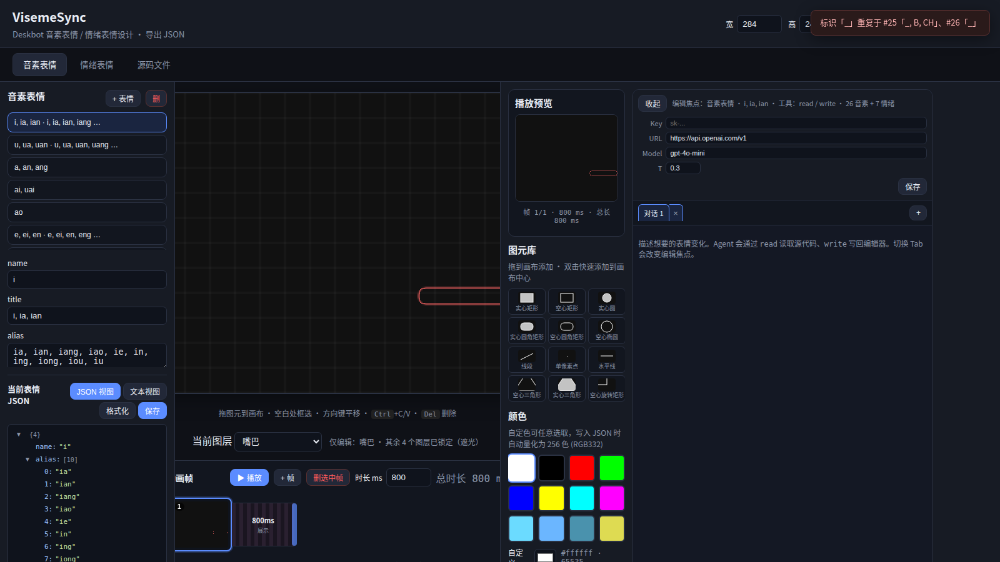
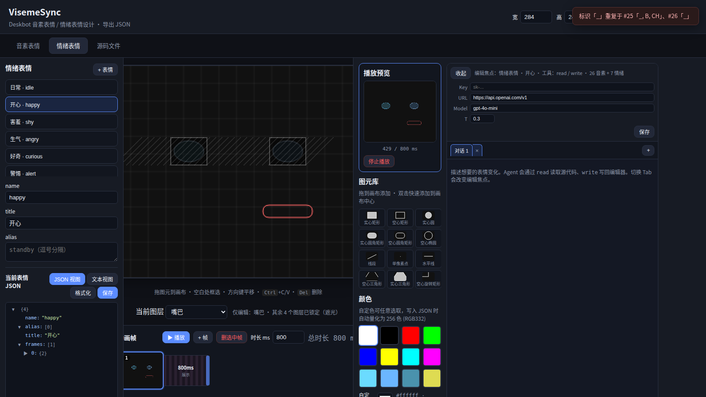
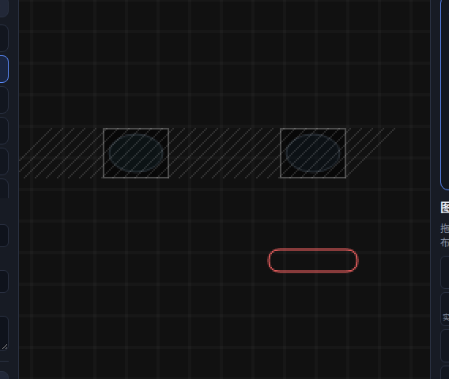
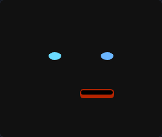
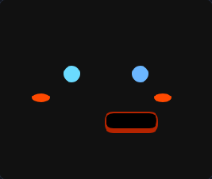
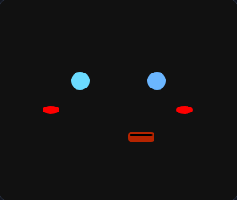
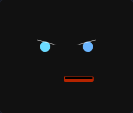
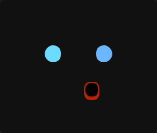
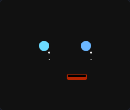
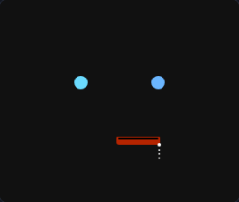

# VisemeSync

**为小机器人设计 OLED 脸——口型、情绪、动画，所见即所得。**

VisemeSync 是 [Deskbot](https://github.com/OpenDeskBot) 开源小机器人的**表情设计工具**：在浏览器里用与设备一致的矢量图元（圆、椭圆、圆角矩形等）绘制 284×240 人脸，导出 JSON 后可直接烧录到机器人 Flash，TTS 说话时自动匹配口型，待机时播放眨眼、开心、害羞等情绪动画。

纯静态前端，**无需 Node.js** 即可使用在线版或本地打开。

---

## 在线体验

**[https://opendeskbot.github.io/visemesync/](https://opendeskbot.github.io/visemesync/)**

打开即可编辑；内置模板需命名后保存到浏览器 localStorage，也可导入/导出完整项目。







---

## 内置表情动画

默认设计 [`deskbot-default.json`](data/deskbot-default.json) 已包含 **40+ 汉语拼音口型** 与 **7 种情绪动画**，导入 VisemeSync 或部署到机器人即可直接使用。

**[⬇ 下载 deskbot-default.json（Raw，可直接用于 Deskbot）](https://raw.githubusercontent.com/OpenDeskBot/visemesync/main/data/deskbot-default.json)**

<p align="center">
  <br/>
  <sub><b>idle</b> 日常待机 · 眨眼</sub>
</p>

<p align="center">
  
  
  <br/>
  <sub><b>happy</b> 开心 · <b>shy</b> 害羞 · <b>angry</b> 生气</sub>
</p>

<p align="center">
  
  
  <br/>
  <sub><b>surprised</b> 惊讶 · <b>sad</b> 难过 · <b>sleep</b> 睡觉</sub>
</p>

> 重新生成预览资源：启动本地 HTTP 服务后运行 `node scripts/capture-emotion-gifs.mjs`（需 `scripts/` 下安装 puppeteer，系统安装 ffmpeg）。

---

## 设计文件格式

音素与情绪统一在一个 JSON 中：

```json
{
  "name": "deskbot-default",
  "description": "…",
  "phonemes": [ { "name", "alias", "title", "frames": [{ "ms", "elements" }] } ],
  "emotions": [ { "name", "alias", "title", "frames": [{ "ms", "elements" }] } ]
}
```

- **phonemes**：TTS 按 `name` / `alias` 匹配口型；多帧可做过渡（如 `ai` → a 再 i）
- **emotions**：待机/交互表情；`alias` 可写 `default`、`standby` 等别名

---

## 本地预览

```bash
git clone https://github.com/OpenDeskBot/visemesync.git
cd visemesync
python3 -m http.server 8088
```

浏览器打开 http://127.0.0.1:8088/（须 HTTP 访问，不能直接 `file://`）。

---

## 功能概览

| 模块 | 说明 |
|------|------|
| **音素 phonemes** | 编辑口型列表、别名、多帧过渡 |
| **情绪 emotions** | 多帧时间轴、帧间插值播放预览 |
| **画布** | 284×240 可改；拖拽图元、框选、撤销/重做 |
| **Agent** | 对话式辅助，优先 `patch` 增量修改设计 |
| **项目** | localStorage 保存；导出/导入 ZIP 或 JSON |

---

## 部署到机器人

将导出的 JSON 复制为 Deskbot 服务端人脸数据：

`brufik_in_one/service/deskbot-server/data/deskbot-face.json`

- **TTS 口型**：按 `phonemes` 的 `name` / `alias` 匹配，使用对应帧的完整 `elements`
- **情绪动画**：按 `emotions` 播放多帧动画（支持 `alias`，如 `idle` ↔ `default`）

---

## 许可证

与 [OpenDeskBot](https://github.com/OpenDeskBot) 项目保持一致。
